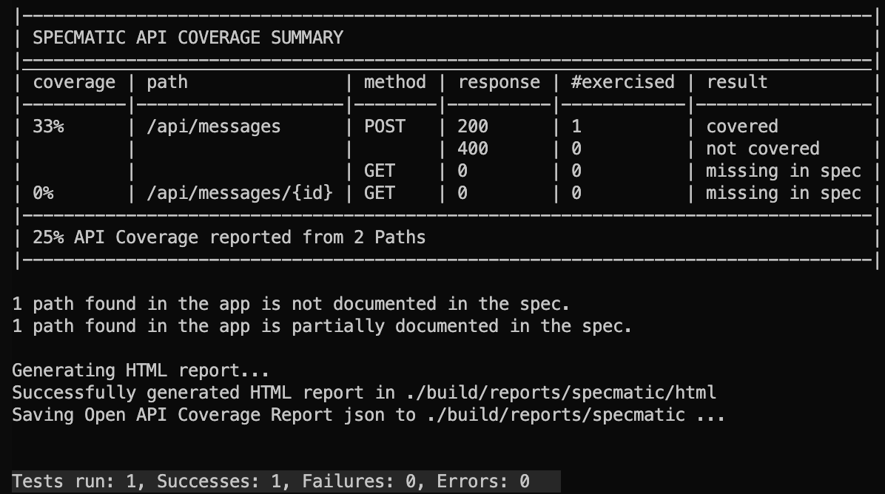
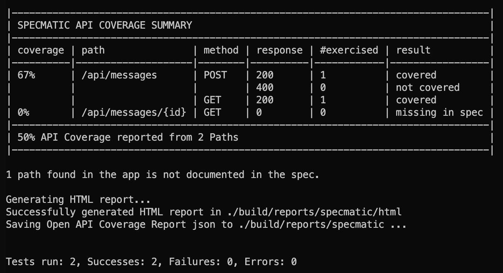

# Zero to Hero with Specmatic Contract Testing

## Required Dependencies

- A `docker` socket available
- `Make` installed

## Provider Contract Testing

### Step 1: Our first contract test

1. In a terminal window, run `make up` to make our REST server available on `http://localhost:3000`
2. In a separate terminal window, run `make contract-test` to run specmatic against our server
3. Review the specmatic output, which should look like the following

### Step 2: Adding a new route to the spec

1. Add the GET `/api/messages` route, which returns an array of `Message`
2. Run `make contract-test` again to check that your API spec now conforms to the implementation.
3. If needed, review `service_final.yaml` for an example.

### Step 3: Our first examples

1. Add a GET `/api/message/<id>` route, which expects a UUID `id` parameter in the path, and returns a `Message`.
2. Run `make contract-test` and review the specmatic output.
3. Add request/response examples to make the test pass.
   1. You will need to add examples to both POST `/api/messages` and GET `/api/messages/<id>`
   2. Make sure to name all the examples the same
4. If needed, review `service_final.yaml` for an example.

### Step 4: Our first negative examples

1. Add a negative example for POST `/api/messages`.
2. Run `make contract-test` and review to ensure you're at 100% API coverage.
3. Remove the `@NotNull` decorators in `CreateMEssageRequest.java`.
4. Run `make contract-test` to show how the test failing now you're not receiving a 400 status code.

### Step 5: Making examples manageable

1. Add a folder called `service_examples`
2. Run `make generate-examples`
3. Remove all the examples from `service.yaml`
4. Run `make contract-test-examples`
5. Fix the broken test by ensuring the message exists for GET `/api/messages/<id>`

### Extension

1. Add a route to the API specification that isn't implemented. What result does specmatic give now?
2. Implement your new route

## Generative Tests
